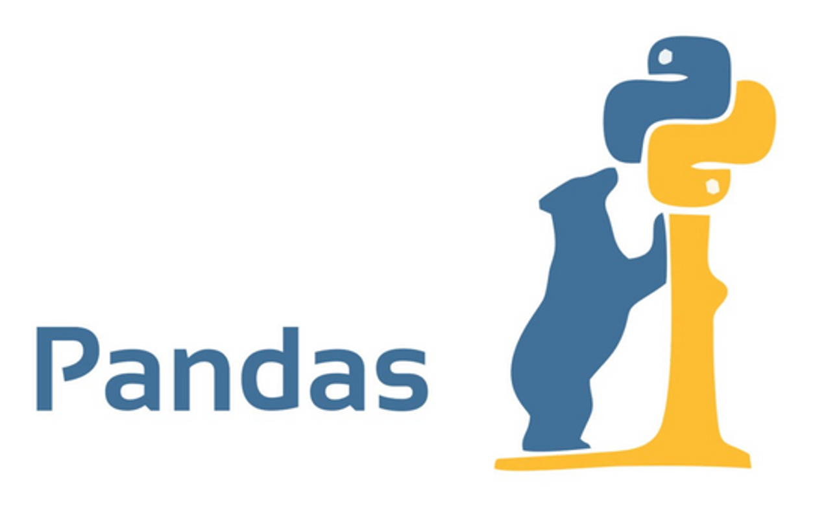
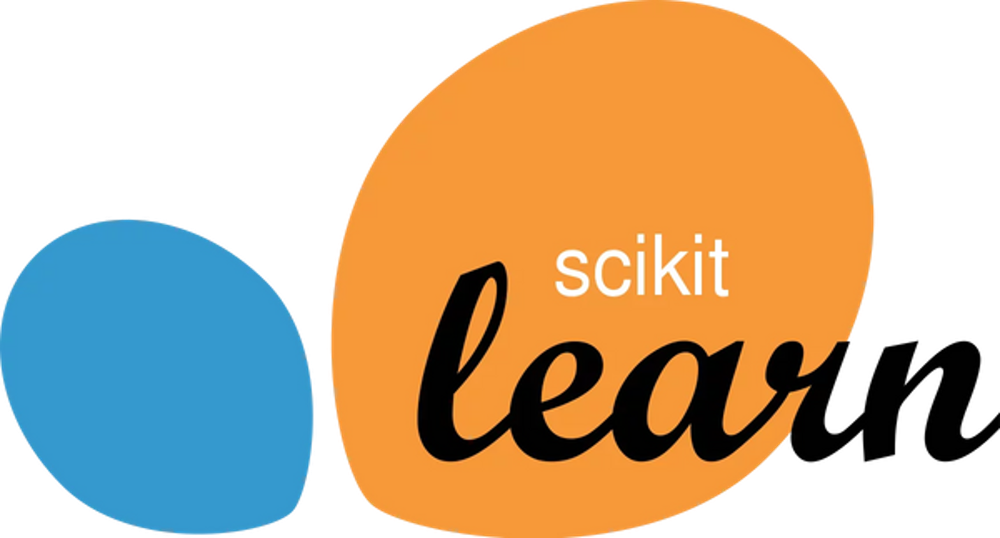

___
# Diabetes Prediction Health Indicator
___

## Problem Overview

The rising epidemic of diabetes and cardiovascular diseases is a significant issue, particularly among adults. A key factor contributing to poor health outcomes is the lack of awareness and understanding about diabetes. Increasing awareness and education about diabetes can help improve health conditions and prevent the progression of these diseases.

  

    
  

  

    

      Diabetes often does not show any obvious symptoms in its early stages. However, it can cause significant harm inside the body.
    

  

## Solution 

    We have implemented a machine learning model that predicts diabetes conditions (diabetes, no diabetes, pre-diabetes) based on various lifestyle features. This allows patients to check their diabetes status from home.

## Implementation

* Selected a huge data set which is the servey responses from the people in US.
* Pre-process the data as appropriate for the machine learning models.
    + Deal with missing values in the datset.
* Feature extraction (Removing the noicy data)
    + Filter out only the higher variance feature than the given threshold value.
    + Select features that have high correlation with the target vector.
    + Check pairwise correlation of the features and eliminate the redundant features.

* Implementing machine learning model and evaluating model performance
    <b>+ Random Forest</b>
    + Support Vector Machine (SVM)
    + Logistic Regression
    + Gradient Boosting

* Produce a weighted essemble model that gives best accuracy.

* Deployment of model with CI/CD pipeline.

## Tech Stack

